# Tutorial system identifier dan PID

1. Clone repisitory ini. clone dengan git jika sudah terinstall git atau Download Zip jika belum. 
        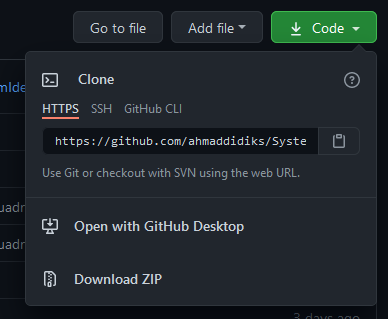


2. Pastikan *wiring* dilakukan dengan benar.
```
    pinA Encoder        ke pinDigital 2 Arduino
    pinB Encoder        ke pinDigital 9 Arduino
    pinMINA EMS 30A     ke pinDigital 6 Arduino
    pinMINB EMS 30A     ke pinDigital 7 Arduino
    PIN PWM EMS 30A     ke pinDigital 5 Arduino
    PINMENA dan MENB EMS 30A silahkan langsung dihubungkan VCC karena default ON HIGH

```


3. Install library AutoPID by Ryan Dawning
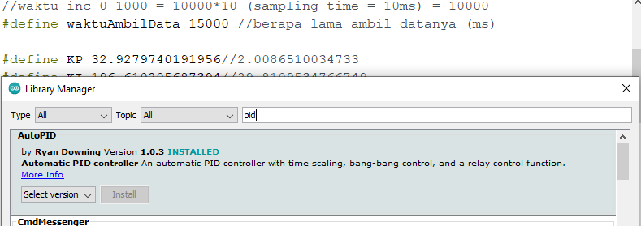


4. Upload file Arduino [CollectingDataset](CollectingDataset/CollectingDataset.ino) , kemudian lihat hasilnya di serial monitor. Jangan lupa unchecklist show timestamp dan BaudRate di 57600 \
Uncomment motorDriverTest:
```
    //run this code for motor driver test
       motorDriverTest();
    //Run this code for collecting data
    //nilaiAcak();
    
    //Run this code for PID Test
    //PIDTest();
```
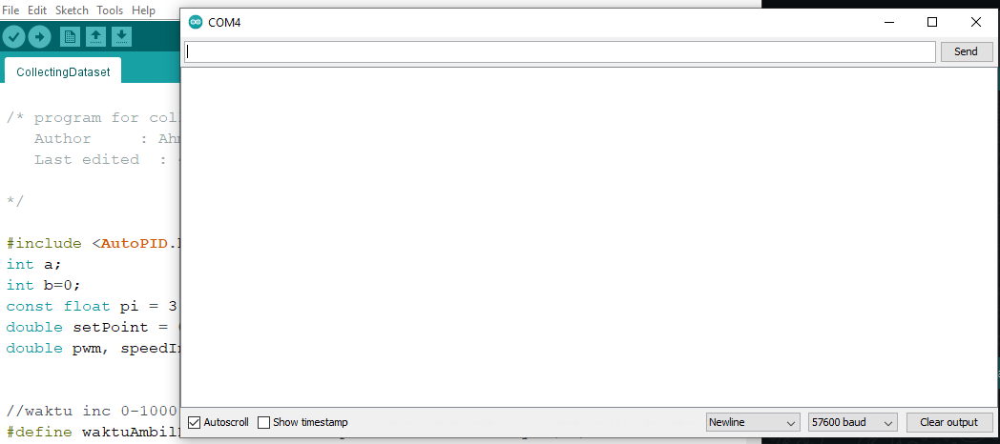


5. Copy hasil serial monitor pindahkan ke Matlab, hapus "Collecting dataset in 5-1", lihat [datasetRandomValue](matlab/datasetRandomValue.m)
```
        x = random(:,1);
        y = random(:,2);
        plot(x) 
        hold on 
        plot(y)
        hold off
```
Variabel 'x' mengambil kolom 1 dari data yang mana adalah input PWM dan varial 'y' mengambil kolom 2  dari data yang mana adalah output berupa RPM motor. Lihat hasil plot juga untuk memastikan data. lihat gambar berikut:

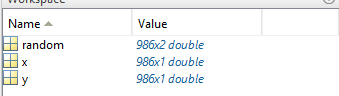    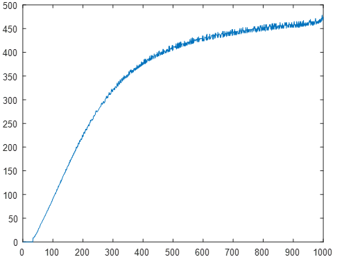 

## LANGSUNG KE LANGKAH 7 JIKA HANYA MENGGUNAKAN DATA STEP (HASILNYA TIDAK BEDA JAUH)!!!

Dapat dilihat bahwa linieritas dari PWM 100-700. maka rubah range nilai acak 100-700 (sesuaikan percobaanmu):
```
        nilaiRandom = random(100,700); //10-70%
```

6. Ulangi langkah no 4 sampai 5 dengan uncomment nilaiAcak():
```
    //run this code for motor driver test
    // motorDriverTest();
    //Run this code for collecting data
        nilaiAcak();
    
    //Run this code for PID Test
    //PIDTest();
```

7. Buka *System Identifier* dengan syntaks berikut di *Command window*.
```
    SystemIdentifier %untuk versi Matlab terbaru
    ident            %untuk versi Matlab lama
```

8. Masukan data x dan y ke *System Identifier*. klik 'import data' kemudian pilih '*Time domain data*'.\
Jika menggunnakan *sampling time* dan *Starting time* yang berbeda jangan lupa diubah sesuai spesifikasi. \
    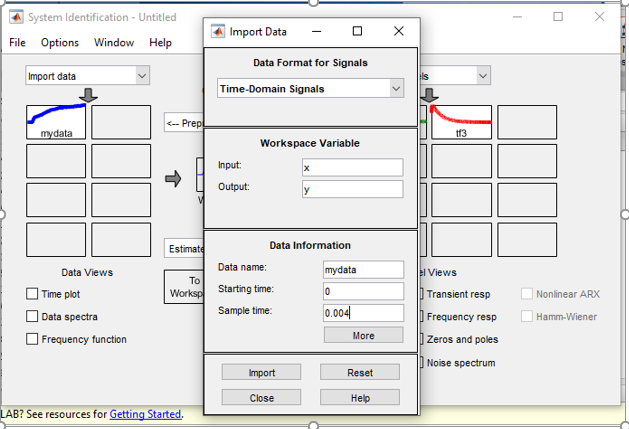

9. Estimasi fungsi alih dengan klik '*Estimate*' working data yang telah dimasukan dan pilih transfer function. \
Disini saya menggunakan 3 pole dan 1 zero... maaf gambar menunjukan 2 zero, silahkan coba-coba untuk mendapatkan *best fit* yang paling tinggi \
*Initial condition* zero karena nilai awal nol, ini terbukti memberikan hasil yang lebih baik!
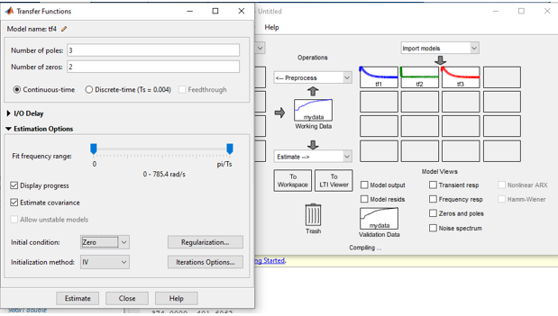 \
Lihat hasil seperti berikut: .... Lakukan sampai hasil terbaikmu!\
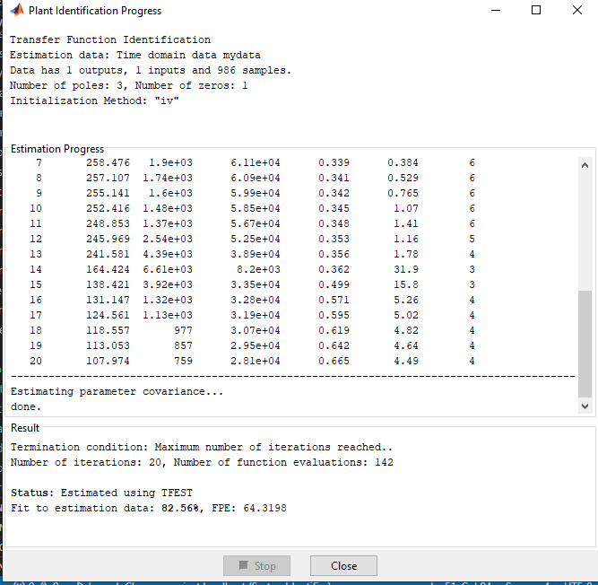 \
Lihat transfer fungsi di kotak hasil (sebelah kanan)... disini aku menghasilkan *best fit* 97.54%\
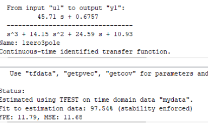

10. Analisa kestabilan fungsi alih yang dihasilkan dengan mencari akar-akar pers. karakteristiknya, jika semua negatif berarti stabil! lihat [Analisa kestabilan](matlab/analisaKestabilan.m)
```
        %analisa kestabilan
        %plot(x,y)
        num = [45.71 0.6757];
        den = [1 14.15 24.59 10.93];

        %fungsi alih open loop
        disp("Fungsi alih open loop")
        sys = tf(num,den)

        %fungsi alih close loop
        disp("Fungsi alih close loop")
        sys1 = feedback(sys,1)

        %akar-akar persamaan karakteristiknya
        disp("Akar-akar pers. karakteristiknya")
        damp(sys1)

        %Posisi akar2 pes. karakteristik
        sgrid
        pzmap(sys1)
        grid on
```

11. Buka simulink dan simulasikan dengan PID, lihat gambar berikut:\
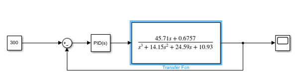

11. Double klik PID dan pilih 'Tune'\
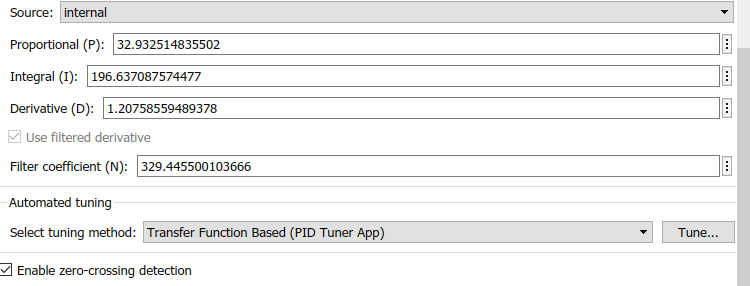 \

Kemudian tuning sesuai keinginanmu! dengan menggeser *time response* , lihat gambar: \
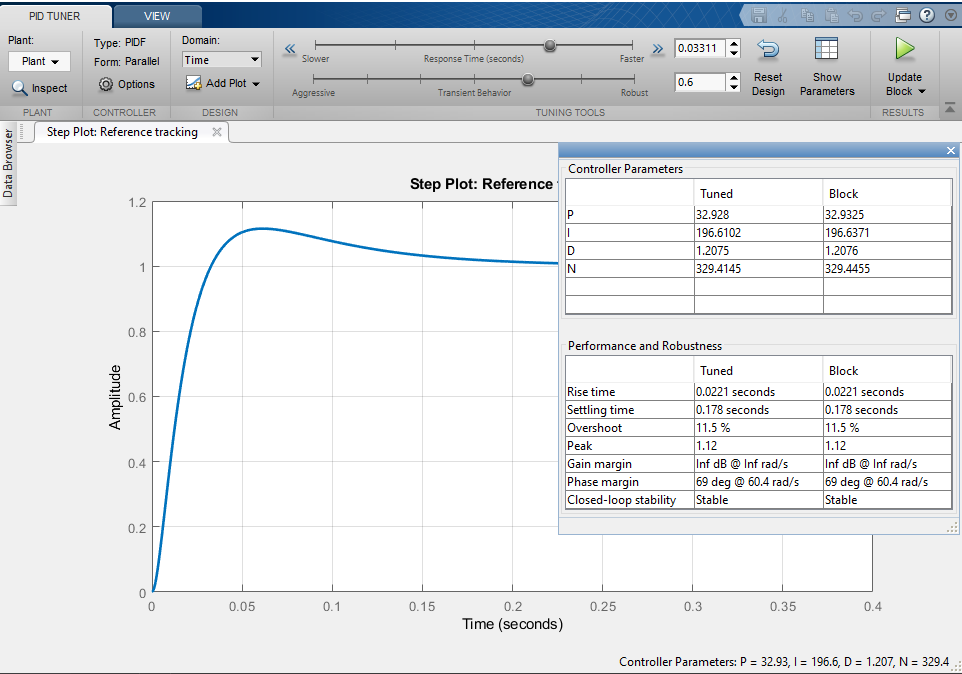 \

12. Simulasikan Hasil PID di simulink, disini menggunakan setpoin 300
 \


